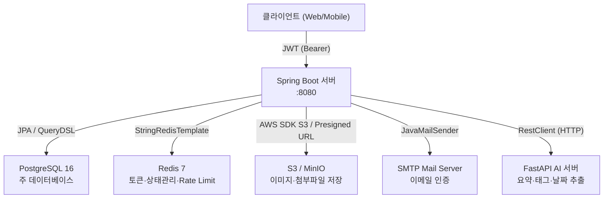
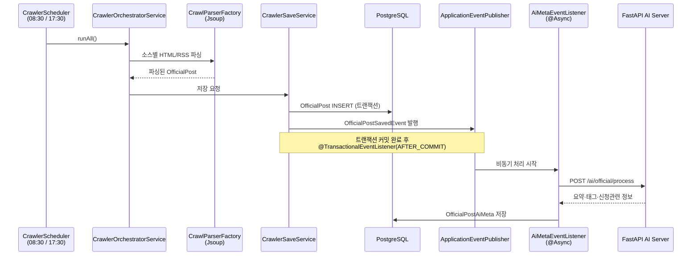
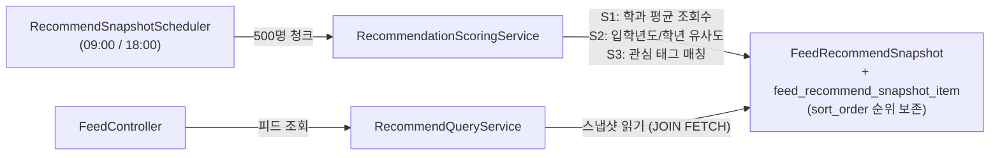
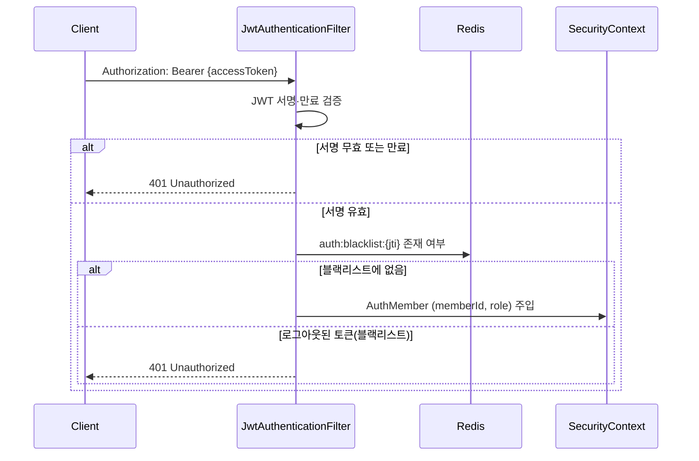

# CampusNavi 백엔드 아키텍처

## 서비스 개요

대학생을 위한 AI 기반 맞춤 정보 제공 플랫폼. 캠퍼스별/단과대별/학과별 공식 공지를 자동 수집·분류하고,
회원의 학적·관심사 기반 개인화 피드를 제공한다.

- **핵심 기능**: 공지 크롤링 → AI 메타 추출 → 개인화 추천 피드
- **기술 스택**: Java 21 / Spring Boot 4 / PostgreSQL 16 / Redis 7

---

## 시스템 구성도



---

## 기술 스택 & 선택 이유

### PostgreSQL 16
FastAPI AI 서버에서 pgvector 확장을 사용할 가능성이 높아 DB를 통일하기로 했다. MySQL은
FK에 인덱스를 자동 생성하지만 PostgreSQL은 그렇지 않아, 실제 조회 패턴에 필요한 인덱스만
명시적으로 관리할 수 있어 인덱스 효율성이 높다.

### Redis (상태 저장소로 활용)
단순 캐시가 아닌 **상태 저장소**로 사용한다. Stateless JWT 구조에서 토큰 무효화
(블랙리스트, RTR)를 DB 쓰기 없이 처리해야 하는 요건을 TTL 기반 Redis로 해결했다.
이메일 인증 Rate Limiting(IP별 쿨다운·블록)도 동일하게 처리해 DB 부하를 분산한다.

### QueryDSL 7 (복잡한 동적 쿼리에 한정)
공식 QueryDSL 업데이트가 종료돼 Jakarta EE 호환 커뮤니티 포크(io.github.openfeign.querydsl)를
사용했다. 조건이 동적으로 조합되는 복잡한 쿼리에만 한정해 도입했다.
JPQL 문자열 방식의 타입 불안전성을 컴파일 타임에 잡는다.

### Flyway
스키마 변경을 코드 변경과 같은 흐름으로 리뷰·배포할 수 있도록 도입했다.
순수 SQL 파일로 마이그레이션을 작성할 수 있어 별도 DSL 없이 직관적으로 관리할 수 있다.

### Testcontainers (PostgreSQL)
H2는 JSONB·배열 연산 등 PostgreSQL 고유 기능을 지원하지 않아 실제 PostgreSQL이 필요했다.
Testcontainers로 테스트 실행 시 도커 컨테이너를 띄워 운영 환경과 동일한 동작을 검증한다.
컨테이너 재사용(싱글톤 패턴)으로 테스트 전체의 시작 오버헤드를 줄였다.

### Apache HttpClient 5 + 커넥션 풀
FastAPI AI 서버 호출에 Spring RestClient + HttpComponents 5 커넥션 풀을 구성했다.
크롤링 이후 대량의 AI 처리 요청이 동시에 발생하는 구조이므로 매 요청마다 TCP 핸드셰이크를
신설하지 않고 풀에서 재사용해 오버헤드를 줄였다.

---

## 도메인 구조

```
src/main/java/com/campusnavi/backend/
├── auth/              - JWT 인증, 이메일 인증
├── member/            - 회원·학적·관심사
├── university/        - 대학·캠퍼스·단과대·학부 계층
├── official/
│   ├── source/        - 크롤링 대상 소스 정의
│   ├── crawler/       - Jsoup 크롤러, 실패 기록·재시도
│   ├── ai/            - FastAPI 연동, 이벤트 처리, 재시도 스케줄러
│   └── post/
│       └── recommend/ - 추천 스냅샷 계산·조회
├── feed/              - 메인 피드 (최신 + 추천)
├── community/         - 게시판·댓글
├── tag/               - 공통 태그 관리
├── scrap/             - 스크랩 폴더
├── mypage/            - 마이페이지
├── notification/      - 활동 알림
├── studio/            - 학업계획서 (개발 중)
├── infra/             - Redis, AI HTTP 클라이언트 등 기술 어댑터
└── global/            - 공통 설정·예외·보안
```

`official` 하위 4개 서브모듈이 단방향으로 흐른다:
`source → crawler → post → ai / recommend`

`feed`는 `official/post`와 `recommend`만 참조하고 직접 DB를 건드리지 않는다.
`infra/` 패키지는 기술 세부사항(Redis, AI HTTP 클라이언트)을 격리해 도메인 코드가
외부 서비스 변경에 영향받지 않도록 한다.

---

## 핵심 플로우

### 1. 크롤링 → AI 메타 처리 파이프라인



**설계 포인트**: `@TransactionalEventListener(AFTER_COMMIT)` + `@Async("aiMetaExecutor")` 조합으로
크롤링 트랜잭션과 AI 처리를 완전히 분리했다. FastAPI 응답 지연(최대 300초)이 크롤링 커밋을
블로킹하지 않으며, AI 처리 실패가 공지 저장을 롤백시키지 않는다.

---

### 2. 개인화 추천 피드



**스코어링 가중치** (application.yml 설정):

| 요소 | 가중치 | 산출 기준                       |
|------|--------|-----------------------------|
| 학과 평균 조회수 (S1) | 0.30 | 동일 학과 회원 조회 평균, max 30회 cap |
| 입학년도/학년 유사도 (S2) | 0.30 | 열람자 중 동일 입학년도 비율 40% + 동일 학년 비율 60% |
| 관심 태그 매칭 (S3) | 0.40 | 공지 태그가 회원 관심사에 포함되면 1.0, 아니면 0 |

---

### 3. JWT 인증 플로우



---

## 성능 · 확장성 고려사항

### 스케줄러 구성과 스레드풀
주기 작업은 목적과 실패 영향 범위가 다르므로 개별 스케줄러·서비스로 분리한다.

| 작업 | 주기 | 역할 |
|------|------|------|
| 크롤링 | 08:30 / 17:30 | 공식 공지 수집·상세 조회·파일 업로드·저장 |
| 크롤링 실패 재시도 | 09:00 / 18:00 | 실패 기록 기준 재시도 |
| 추천 스냅샷 | 09:00 / 18:00 | 회원별 추천 결과 사전 계산·캐싱 |
| 활동 알림 스냅샷 | 09:00 | 전날 추천됐으나 미열람한 공지 저장 |
| AI 실패 재시도 | 30분 fixedDelay | FAILED 상태 AI 메타 재처리 |

Spring 기본 스케줄러는 단일 스레드라 같은 시간대 작업이 직렬로 밀릴 수 있다.
`SchedulingConfig`에서 `ThreadPoolTaskScheduler` pool size를 5로 설정해 09:00에 몰리는
작업(크롤링 재시도·추천 스냅샷·활동 알림)이 서로 블로킹하지 않도록 분리했다.
AI 메타 처리는 이 스케줄러 풀과 별개로 `aiMetaExecutor`에서 처리한다.

### 추천 배치 스냅샷
기획 요구사항에 따라 하루 2회(09:00, 18:00) 배치로 추천을 갱신한다. 각 회원의 추천 공지 ID
목록을 `feed_recommend_snapshot_item` 자식 테이블에 `sort_order`와 함께 사전 계산해 저장한다.
피드 조회 시 스냅샷을 읽기만 하므로, 매 요청마다 전체 회원 × 전체 공지 스코어링(O(N×M))을 수행하지 않아도 된다.
신규·캐시 미스 회원은 조회 시점에 `computeAndUpsert`로 1회 계산해 같은 스냅샷 테이블에 저장하고 이후 요청부터 재사용한다.

### 비동기 AI 처리
FastAPI AI 서버의 응답 시간이 가변적(최대 300초 타임아웃 설정)이므로, 크롤링 트랜잭션
완료 후 별도 스레드 풀(`aiMetaExecutor`: core=2, max=5, queue=100)에서 처리한다. 실패 시
`ProcessingStatus.FAILED`로 기록하고 `AiMetaRetryScheduler`(30분 주기, 최대 3회)가
재시도한다.

### 활동 알림 스냅샷
매일 09:00 스케줄러가 전날 추천된 공지 중 회원이 미열람한 게시글 ID를
`ActivityNotificationSnapshot.post_ids` JSONB로 저장한다. 스냅샷 자체는 기준 시점(전날)의
추천 목록을 보존하는 이력 레코드로, 이후 변경되지 않는다. 알림 탭 조회 시 `official_post_view`를
실시간으로 읽어 현재 기준 미열람 여부를 계산하는 구조로, push 발송이 없는 인앱 알림이다.

### 대량 배치의 청크 처리
추천 스냅샷, 활동 알림 스냅샷 스케줄러 모두 500명 단위 청크로 처리한다. 전체 회원을
한 번에 메모리에 올리면 OOM 위험이 있고, 한 트랜잭션이 길어져 락 경합이 발생할 수 있다.

### Redis Rate Limiting
이메일 인증 코드 발송 쿨다운(10초)·IP별 횟수 제한(10분 내 5회)·블록(30분)을 Redis
`increment()` + TTL로 구현했다. DB 쓰기 없이 처리하므로 인증 트래픽 스파이크가
PostgreSQL에 영향을 주지 않는다.

### 커서 기반 페이지네이션
`OFFSET` 방식은 페이지가 깊어질수록 DB 풀 스캔 비용이 증가한다. 공식정보 목록 조회 등
목록 API는 커서(Base64 인코딩) 기반으로 구현해 어느 페이지에서든 일정한 쿼리 비용을 유지한다.

---

## 보안 아키텍처

- **JWT Stateless**: 서버 세션 없음, Access Token (30분) + Refresh Token (14일)
- **토큰 전송 방식**: Access Token은 Authorization 헤더(Bearer), Refresh Token은 `HttpOnly; SameSite=None; Secure` 쿠키로 전송 — HttpOnly로 XSS 차단, SameSite=None으로 크로스 오리진 쿠키 전송 허용
- **RTR (Refresh Token Rotation)**: 재발급 시 기존 토큰 즉시 삭제 → 토큰 탈취 감지 가능
- **블랙리스트**: 로그아웃 시 Access Token JTI를 Redis에 남은 TTL만큼 저장
- **BCrypt**: 비밀번호 단방향 해시
- **이메일 인증 Rate Limiting**: IP·이메일별 발송 제한, 인증 실패 횟수 제한 (구현 상세 → 성능 섹션)
- **CORS**: 허용 오리진 환경변수로 분리, credentials 허용

### Redis 토큰 키
- **블랙리스트**: `auth:blacklist:{jti}` = `"logout"`, TTL = Access Token 잔여 만료시간(ms) — 자연 만료 시 Redis에서도 자동 삭제
- **RTR**: `auth:refresh:{jti}` = Refresh Token 문자열, TTL 14일 — 저장값과 요청 토큰이 다르면 탈취로 간주하고 거부
- JTI는 토큰별로 `UUID.randomUUID()`로 별도 생성한다

---

## DB 설계 트레이드오프

배치가 사전 계산한 공지 ID 목록을 저장하는 스냅샷 테이블이 둘 있다. 역할은 "계산된 post ID 목록 저장"으로
같지만, 소비 방식이 달라 정규화 방식을 다르게 설계했다.

### feed_recommend_snapshot / _item — 자식 테이블 정규화
추천 결과 캐시. `feed_recommend_snapshot`(헤더)와 `feed_recommend_snapshot_item`(`post_id`, `sort_order`)로 분리했다.
- `official_post_view`와 item 레벨에서 직접 JOIN — "추천됐으나 안 본 공지"를 DB 안에서 계산
- `sort_order`로 추천 순위를 명시적으로 보존 (`@OrderBy("sortOrder ASC")`)
- 갱신 시 items만 삭제·재삽입하고 헤더는 UPSERT로 재사용

### activity_notification_snapshot — 의도적 1NF 위반
"놓친 공지" 캐시. `post_ids`를 `jsonb` 배열 단일 컬럼에 저장한다(1NF 위반). 접근이 항상
`(member_id, missed_date)` 단위로 전체를 읽고, 저장 후 불변이며, 항목별 조회나 JOIN이 없기 때문이다.
미열람 여부는 조회 시점에 `official_post_view`와 차집합으로 계산한다. item 테이블로 쪼개면
JOIN·개별 DELETE 비용만 늘어난다.
